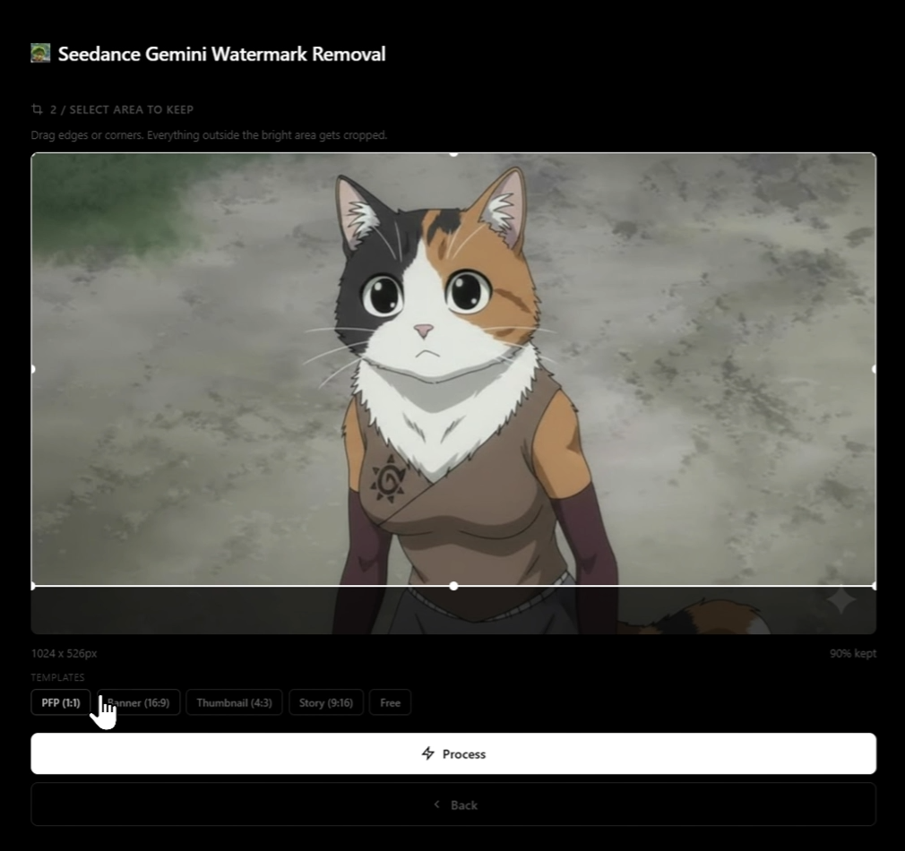

# seedance2.0-gemini-watermark-removal

A lightweight, self-hosted tool for removing watermarks from **Seedance AI-generated videos and images**. Built with Node.js and FFmpeg, it uses precision cropping and Lanczos resampling to cleanly remove watermarks while preserving original quality and resolution.

<p align="center">
  
</p>

## Examples

<details open>
<summary>Click to Expand/Collapse Examples</summary>

### Watermark Removal

| Before | After |
| :---: | :---: |
|  |  |

### Smart Resize (Back to Original Resolution)

| Cropped | Resized to Original |
| :---: | :---: |
|  |  |

### Video Demo

[https://github.com/user-attachments/assets/video.mp4](https://x.com/asterwuu/status/2021730418400395412?s=20)

<video src="video.mp4" width="600" controls></video>

</details>

## Features

1. **Videos & Images** - Process MP4, MOV, AVI, MKV, WEBM, JPG, PNG, WEBP, BMP, and TIFF files
2. **Visual Crop Editor** - Interactive canvas with draggable edges, corners, and move support
3. **Smart Resize** - Videos are cropped then upscaled back to original dimensions using Lanczos interpolation, so output resolution matches input
4. **Aspect Ratio Templates** - One-click presets for PFP (1:1), Banner (16:9), Thumbnail (4:3), and Story (9:16)
5. **Drag & Drop** - Simple drop-your-file interface with instant preview
6. **Sound Effects** - Audio feedback for every interaction
7. **Large File Support** - Handles files up to 500 MB
8. **Self-Hosted** - Runs entirely on your machine. Your files never leave your network

## How It Works

1. **Upload** - Drag and drop (or click to select) a video or image
2. **Crop** - Adjust the crop region to exclude the watermark. The bright area is what you keep
3. **Process** - FFmpeg crops out the watermark region and (for videos) resizes back to the original dimensions
4. **Download** - Compare original vs processed side-by-side and download the result

### Under the Hood

**For images:** FFmpeg applies a single-pass crop to extract the selected region at full quality.

**For videos:** FFmpeg applies a crop + Lanczos scale filter chain:

```
crop=<w>:<h>:<x>:<y>, scale=<origW>:<origH>:flags=lanczos
```

Audio is copied without re-encoding (`-c:a copy`), so there's zero audio quality loss.

## Quick Start

### Prerequisites

- [Node.js](https://nodejs.org/) (v16+)
- [FFmpeg](https://ffmpeg.org/download.html) installed and available in your PATH

### Installation

```bash
# Clone the repository
git clone https://github.com/asterwuu/seedance2.0-gemini-watermark-removal.git
cd seedance2.0-gemini-watermark-removal

# Install dependencies
npm install

# Start the server
npm start
```

The app will be running at **http://localhost:3000**

### One-Liner

```bash
git clone https://github.com/asterwuu/seedance2.0-gemini-watermark-removal.git && cd seedance2.0-gemini-watermark-removal && npm install && npm start
```

## Supported Formats

| Type | Formats |
| :--- | :--- |
| Video | `.mp4` `.mov` `.avi` `.mkv` `.webm` |
| Image | `.jpg` `.jpeg` `.png` `.webp` `.bmp` `.tiff` |

## Project Structure

```
seedance2.0-gemini-watermark-removal/
├── server.js          # Express server — upload, preview, crop & process endpoints
├── package.json       # Dependencies (express, multer, fluent-ffmpeg)
├── public/
│   ├── index.html     # Single-page app with crop editor UI
│   └── icon.png       # App icon
├── uploads/           # Temporary uploaded files (auto-created)
└── output/            # Processed results (auto-created)
```

## API Endpoints

| Method | Endpoint | Description |
| :--- | :--- | :--- |
| `POST` | `/preview` | Upload a file and receive a thumbnail + metadata |
| `POST` | `/process` | Crop & process with exact coordinates |
| `GET` | `/download/:filename` | Download a processed file |

## Disclaimer

> **USE AT YOUR OWN RISK**
>
> This tool modifies media files. While it is designed to work reliably, unexpected results may occur due to:
> - Unusual video codecs or container formats
> - Corrupted or non-standard files
> - Edge cases with EXIF rotation or exotic resolutions
>
> The author assumes no responsibility for any data loss, file corruption, or unintended modifications. By using this tool, you acknowledge and accept these risks.

> **Note**: This tool is provided for **personal and educational use only**. The removal of watermarks may have legal implications depending on your jurisdiction. Users are solely responsible for ensuring compliance with applicable laws and terms of service.

## Credits

Developed by [asterwuu](https://github.com/asterwuu)
My X: [@asterwuu](https://x.com/asterwuu)

## License

[MIT License](./LICENSE)
